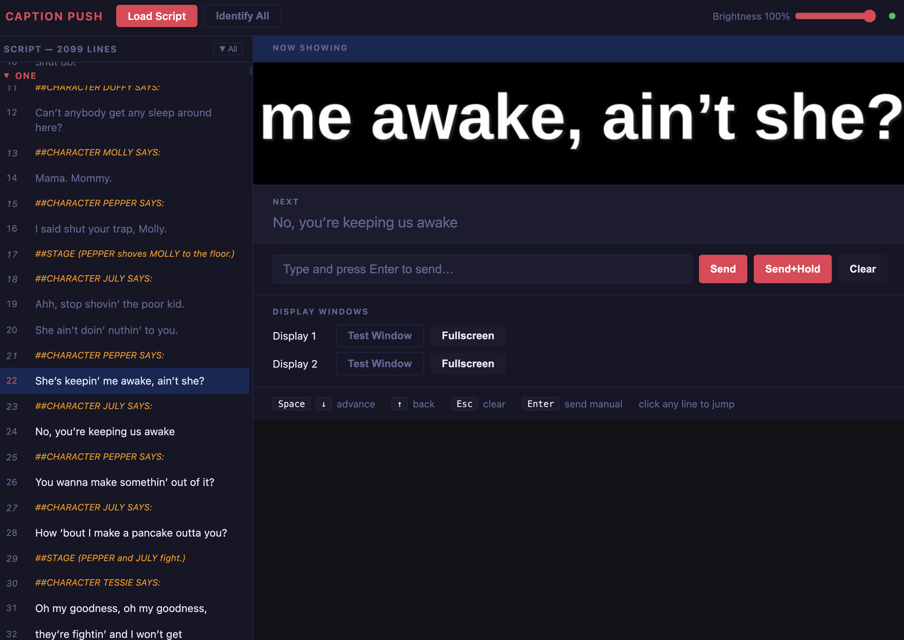

# Caption Push

Real-time captioning for live theater. An operator pushes script lines to audience-facing displays — all screens update simultaneously in under 15 ms.



---

## How it works

A browser-based operator console runs on any laptop. The operator advances through a pre-loaded script using the keyboard, and each caption line is broadcast over the local network to one or more display units. The recommended display is any HDMI monitor running a fullscreen browser window — no special hardware required. HUB75 RGB LED matrix panels driven by a Raspberry Pi are also supported for large-format outdoor signage.

```
Operator Browser → WebSocket → Node Bridge → ZeroMQ PUB → Display Computer(s)
```

---

## Quick Start (Docker Desktop)

Docker Desktop is the recommended runtime. Everything — the operator console, the caption renderer, and the display outputs — runs in containers. The audience-facing displays are browser windows that you open fullscreen on HDMI monitors.

### Prerequisites

- [Docker Desktop](https://www.docker.com/products/docker-desktop/) (Mac or Windows)
- A modern browser (Chrome, Firefox, Safari)
- One or more external HDMI monitors for display (optional for testing, required for shows)

### 1. Clone the repository

```bash
git clone https://github.com/markscott/caption-push.git
cd caption-push
```

### 2. Build and start

```bash
docker compose up --build -d
```

This builds three containers and starts them in the background:
- **bridge** — operator UI + WebSocket server + ZeroMQ publisher (port 4000)
- **display1** — caption renderer #1 with browser-accessible output (port 6080)
- **display2** — caption renderer #2 with browser-accessible output (port 6081)

The first build takes a few minutes. Subsequent starts are fast.

### 3. Open the operator console

On your operator laptop, open:

```
http://localhost:4000
```

### 4. Put the displays on HDMI monitors

For each physical display screen, open a browser window and navigate to the display URL, then move that window to the HDMI monitor and go fullscreen.

| Display | URL | Shortcut to fullscreen |
|---|---|---|
| Display 1 | http://localhost:6080 | `F11` (Windows/Linux) or `⌃⌘F` (Mac) |
| Display 2 | http://localhost:6081 | Same |

The page auto-connects and scales the caption output to fill the entire screen. The result is white bold text on a black background — clean and legible at distance.

You can also click **Test Window** or **Fullscreen** in the operator UI's Display Windows section to launch these directly.

### 5. Load a script and start pushing captions

1. Click **Load Script** in the toolbar
2. Select any `.srt` or `.txt` file (see [Script Format](#script-format) below)
3. Press **Space** or **↓** to send the first line to all displays
4. Keep pressing **Space** to advance through the script

### 6. Stop

```bash
docker compose down
```

---

## Operator UI Reference

### Toolbar

| Control | Action |
|---|---|
| **Load Script** | Open a `.srt` or `.txt` caption file |
| **Identify All** | Flash each display panel with its number for 2 seconds |
| **Brightness slider** | Adjust display brightness (10–100%) live |
| **Green/red dot** | WebSocket connection status (green = connected) |

### Script panel (left)

The script panel shows the full script organized by scene. The current line is highlighted. Past lines are dimmed.

- **Click any line** to jump to it and push it immediately
- **Scene headers** (e.g., `ONE`) are collapsible — click to expand/collapse
- `##CHARACTER` and `##STAGE` lines appear in the script but are never sent to displays

### Now Showing / Next

The **Now Showing** panel renders a live pixel-accurate preview of what is on the displays right now. **Next** shows the upcoming line so the operator can anticipate cue timing.

### Manual entry

Type any text and press **Enter** (or click **Send**) to push it immediately outside the script flow. Useful for unscripted announcements.

**Send+Hold** (`Shift+Enter` or the button) pushes text and suppresses the 10-second auto-clear, so it stays on screen until explicitly cleared.

### Display Windows

Opens the caption output for Display 1 or Display 2 in a new browser window. Use **Test Window** for a small monitoring view alongside the operator console. Use **Fullscreen** to open a window already sized to fill the screen — drag it to an HDMI monitor and it's ready to go.

### Keyboard shortcuts

| Key | Action |
|---|---|
| `Space` or `↓` | Advance to next script line |
| `↑` | Go back one line |
| `Esc` | Clear all displays |
| `Enter` | Send manual entry |
| `Shift+Enter` | Send manual entry with hold |

---

## Script Format

### Plain text (`.txt`) — recommended

One caption line per non-`##` line. Special `##` markers structure the script for the operator but are never sent to displays.

```
##SCENE ONE
##STAGE (Lights rise on the orphanage dormitory.)

##CHARACTER MOLLY SAYS:
Mama! Mama! Mommy!

##CHARACTER PEPPER SAYS:
Shut up!

##STAGE (PEPPER shoves MOLLY to the floor.)

##CHARACTER JULY SAYS:
She ain't doin' nuthin' to you.
```

**`##` marker types:**

| Marker | Appearance in UI | Sent to display? |
|---|---|---|
| `##SCENE <title>` | Bold scene header, collapsible | No |
| `##CHARACTER <name>` | Amber italic | No |
| `##STAGE <description>` | Red italic | No |
| Any other `##` line | Dimmed metadata | No |

### Encoding note

Save script files as **UTF-8**. Most modern editors do this by default (VS Code, Notepad++, Windows 11 Notepad). Older Windows editors (Notepad on Windows 10 and earlier, Word `.txt` export) may save as Windows-1252, which will corrupt curly quotes, em-dashes, and accented characters. If characters look wrong after loading, re-save the file as UTF-8.

### SRT (`.srt`)

Standard subtitle format. Timestamps are parsed and shown but the operator controls timing manually — Caption Push does not auto-advance.

```
1
00:00:01,000 --> 00:00:03,500
She ain't doin' nuthin' to you.

2
00:00:04,000 --> 00:00:06,000
No, you're keeping us awake.
```

---

## Live Show Setup (HDMI Monitors)

For a real show the setup is the same as the quick start, with a few additional steps for physical positioning and network.

### Recommended hardware

| Item | Notes |
|---|---|
| Operator laptop | Any modern Mac or Windows machine with Docker Desktop |
| HDMI monitor per display location | Any TV or monitor works; 1080p or 4K, any aspect ratio |
| HDMI cable or wireless HDMI sender | For routing signal from laptop to display position |
| Dedicated WiFi access point (optional) | Keeps theater traffic off public WiFi; reduces latency variance |

### Single-computer setup (laptop + one or more HDMI monitors)

The simplest configuration: run everything on the operator laptop, connect HDMI monitors directly, and drag the display browser windows to each screen.

```
Operator Laptop
├── Docker Desktop (bridge + display1 + display2 containers)
├── Operator browser window (http://localhost:4000) — stays on laptop screen
├── Display 1 browser window (http://localhost:6080) — moved to HDMI monitor 1, fullscreen
└── Display 2 browser window (http://localhost:6081) — moved to HDMI monitor 2, fullscreen
```

Steps:
1. `docker compose up -d`
2. Open http://localhost:4000 as your operator console
3. Open http://localhost:6080 in a new window, drag it to the first HDMI monitor, go fullscreen
4. Repeat for http://localhost:6081 on the second monitor
5. Load your script and start the show

### Two-computer setup (separate operator and display machines)

For longer cable runs or when the operator is far from the display positions, run the display containers on a dedicated machine that stays near the screens.

```
Operator Laptop ─── WiFi/LAN ─── Display Computer
  http://192.168.1.50:4000           docker compose up display1 display2
  (operator console)                 HDMI → Monitor 1
                                     HDMI → Monitor 2
```

On the **display computer**, edit `docker-compose.yml` to point at the operator laptop's IP and start only the display containers:

```bash
# On display computer — set CONTROLLER_ADDRESS to operator laptop's IP
CONTROLLER_ADDRESS=tcp://192.168.1.100:5555 docker compose up display1 display2 -d
```

On the **operator laptop**, start only the bridge:

```bash
docker compose up bridge -d
# Open http://localhost:4000
```

Then on the display computer open http://localhost:6080 and http://localhost:6081 fullscreen on the connected monitors.

### Display resolution and font size

The default configuration uses a 1920×360 canvas (a widescreen letterbox bar). Adjust in `docker-compose.yml` to match your monitor:

```yaml
environment:
  PANEL_WIDTH: "1920"    # monitor width in pixels
  PANEL_HEIGHT: "360"    # height of the caption bar (not full monitor height)
  FONT_SIZE: "320"       # should be roughly PANEL_HEIGHT × 0.9
```

For a full 1080p screen showing only captions: set `PANEL_HEIGHT: "1080"` and `FONT_SIZE: "900"`.

The noVNC viewer scales the output to fill the browser window, so the caption bar will stretch to fill whatever screen size you use — no pixel-perfect matching required.

### Network tips

- A dedicated 2.4 GHz or 5 GHz access point is recommended for show night
- Keep theater traffic on its own SSID away from public WiFi
- Latency over WiFi is 2–8 ms — imperceptible for captions

---

## Advanced: Raspberry Pi + LED Matrix Panels

For large-format LED matrix displays (HUB75 panels), a Raspberry Pi drives the panels directly. This path requires more hardware setup but produces a very bright, high-contrast display visible across large venues.

### Hardware per display unit

| Part | Notes |
|---|---|
| Raspberry Pi Zero 2 W | ~$15; enough power for two chained 64×32 panels |
| HUB75 64×32 RGB panel × 2 | P4 pitch readable at 10 ft, P5 at 15 ft+ |
| Adafruit RGB Matrix Bonnet | Clean GPIO wiring for HUB75 |
| 5 V 4 A power supply per panel | Panels draw up to 3.5 A at full white |
| 16 GB microSD (A1 class) | Use read-only root for power-cut resilience |

### Provisioning a Pi

Run the setup script once per Pi. Set `CONTROLLER_IP` to the IP of the machine running the bridge.

```bash
# On the Pi — run from the caption-push repo directory
CONTROLLER_IP=192.168.1.100 DISPLAY_ID=1 bash install/pi_setup.sh

sudo reboot
```

The script:
1. Disables onboard audio (it shares a PWM peripheral with the HUB75 driver)
2. Installs Python deps (`pyzmq`, `Pillow`, `numpy`)
3. Builds and installs `rpi-rgb-led-matrix`
4. Installs a systemd service that starts the display daemon on boot

### Checking Pi display status

```bash
# Watch live logs
sudo journalctl -fu caption-display.service
```

Use **Identify All** in the operator UI to flash each panel's number for 2 seconds — useful for confirming which Pi is which when mounting panels.

### Adjusting panel configuration

Edit `/opt/caption-push/display.env` on the Pi and restart the service:

```bash
CONTROLLER_IP=192.168.1.100
DISPLAY_ID=2
PANEL_WIDTH=128     # total pixel width (panel_width × chain_length)
PANEL_HEIGHT=32     # total pixel height
FONT_SIZE=24
```

---

## Troubleshooting

### Display screen is black after opening the URL

The display container takes 10–15 seconds to start after `docker compose up`. Wait and refresh. If it stays black:

```bash
docker compose restart display1
```

### Operator console shows text in "Now Showing" but the display screen is black

The display container is running but nothing has been sent yet. Load a script and press **Space** to push the first line.

### Displays show nothing after sending a line

1. Confirm the green dot in the operator UI toolbar is lit — if not, the WebSocket is down
2. Check the bridge logs: `docker compose logs bridge`
3. Check display logs: `docker compose logs display1`
4. Click **Identify All** — if displays flash their numbers, ZeroMQ is working and only the `show` command failed

### Display goes blank mid-show

ZeroMQ drops messages sent before a subscriber connects (no buffering). If a display container restarts mid-show, it shows blank until the next line is sent. Press `↑` then `↓` to re-send the current line.

### Text is cut off or the font looks very small

`FONT_SIZE` should be roughly `PANEL_HEIGHT × 0.9`. If you changed `PANEL_HEIGHT` in `docker-compose.yml`, update `FONT_SIZE` to match and rebuild:

```bash
docker compose up --build -d
```

### `docker compose up` fails to build

```bash
docker compose build --no-cache
docker compose up -d
```

### Display browser window doesn't fill the HDMI monitor

The noVNC page scales to the browser window. Make sure the browser is actually fullscreen (not just maximized) on the target monitor. Use `F11` on Windows/Linux or `⌃⌘F` on Mac. The caption output will scale to fill whatever size the window is.

### Pi display daemon crashes at startup (LED matrix path only)

Almost always an audio PWM conflict. Confirm `/boot/firmware/config.txt` contains `dtparam=audio=off` and reboot.

---

## Project Structure

```
caption-push/
├── controller/                 # Operator console
│   ├── server.ts               # Node.js: Express + WebSocket + ZeroMQ PUB
│   └── src/
│       ├── App.tsx             # React operator UI
│       ├── SimDisplay.tsx      # Live preview canvas in operator UI
│       ├── scriptParser.ts     # SRT + plaintext parser (browser-side)
│       └── types.ts            # Shared TypeScript types
├── display/                    # Display daemon (Python)
│   ├── daemon.py               # Main loop: ZMQ SUB → render → matrix
│   ├── renderer.py             # Text + emoji → PIL Image
│   ├── matrix_sim.py           # Pygame LED simulator (dev/Docker)
│   └── matrix_real.py          # rpi-rgb-led-matrix wrapper (Pi)
├── docker/
│   ├── Dockerfile.bridge       # Node bridge container
│   ├── Dockerfile.display      # Python display + Xvfb + VNC container
│   └── display-entrypoint.sh   # Container startup: Xvfb → VNC → daemon
├── install/
│   ├── pi_setup.sh             # One-shot Pi provisioning script
│   └── caption-display.service # systemd unit
├── scripts/                    # Example caption scripts
├── docs/
│   ├── DESIGN.md               # Architecture and design reference
│   └── images/
└── docker-compose.yml
```

---

## License

MIT
